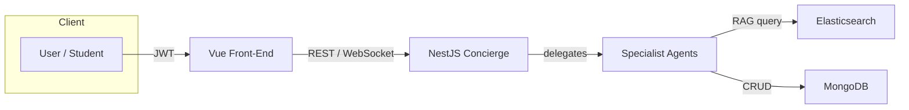

# GolferGeek AI — Architecture Overview

## High-Level Component Flow

## Key Pieces
1. **Auth0** – Issues JWTs consumed by Vue & NestJS.
2. **NestJS Concierge** – Receives tasks, selects appropriate agent.
3. **Specialist Agents** – Post-Writer, InvoiceBot, etc., each a NestJS module or external service.
4. **MongoDB** – Stores structured data (posts, users, agent logs).
5. **Elasticsearch** – Vector index for Retrieval-Augmented Generation.

## Observability (Planned)
* Structured JSON logs via Pino → stdout → cloud log collector.
* Request tracing with OpenTelemetry (traceId forwarded from front-end).
* Error alerts through Opsgenie or Slack webhook.

## Deployment Checklist (WIP)
- [ ] Docker image build succeeds locally (`docker compose up`).
- [ ] `AUTH0_DOMAIN`, `MONGODB_URI`, `ES_URI` provided.
- [ ] Fly.io app created with two processes (`api`, `worker`).
- [ ] First-time seed script executed (`npm run seed`).

*Last updated: May 2025* 